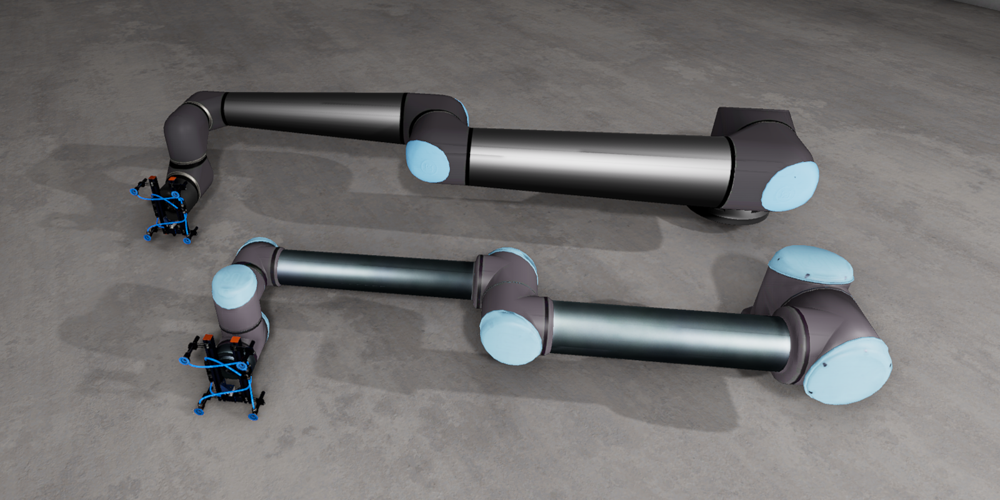
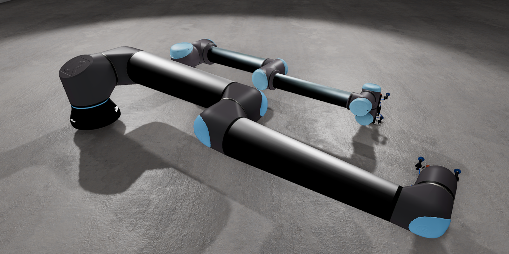

[![Apache License, Version 2.0][apache_shield]][apache]

# UR10 and UR20 Robots Gem for Open 3D Engine (O3DE)

## A bit of context

* [Open 3D Engine](https:://o3de.org) - an open-source game & simulation engine. O3DE is extendable through modules called Gems. This is one of such Gems.
* [Robot Operating System (ROS)](https://docs.ros.org/en/rolling/index.html) - an open-source middleware and, de facto, standard for robotics.
* [ROS2 Gem](https://github.com/o3de/o3de-extras/tree/development/Gems/ROS2) - an open-source module for O3DE that enables simulation for robotics using modern ROS.
* [Universal Robots](https://www.universal-robots.com/) - Universal Robots provides duty industrial collaborative robotic arms for manufacturing facilities and warehouses.

Please refer to [O3DE documentation](https://docs.o3de.org/docs/user-guide/gems/) to learn more about Gems and about registering Gems in the system and O3DE projects.

## Requirements
- Any O3DE project with the [O3DE ROS2 Gem](https://github.com/o3de/o3de-extras/tree/development/Gems/ROS2) enabled.

## Description
This is an Asset Gem only. It contains the following assets:
- [UR10](https://www.universal-robots.com/products/ur10-robot/)
- [UR20](https://www.universal-robots.com/products/ur20-robot/)
- pneumatic vacuum end effector

O3DE models of the robots are based on the Unified Robot Description Format (URDF) files. The models were converted to O3DE _prefabs_ using a built-in robot importer.

The assets are delivered as O3DE _prefabs_ in the following folder structure:
```
Assets
├── UR10
│   └── UR10.prefab
└── UR20
    └── UR20.prefab

```

in which `UR10.prefab` and `UR20.prefab` model Universal Robots UR10 and Universal Robots UR20 robotic arms respectively. Robots contain visual models, colliders and physics, along with the following ROS components:
- ROS2 Frame
- ROS2 Robot Control

## Screenshots



## Release notes
### 2.0.0 for O3DE 2409.x
Changes compared to `1.0.0`
- Prefabs modified to work with `ROS2 Gem >= 3.1.0`

### 1.0.0 for O3DE 2310.x
Initial release prepared for initial version of [ROSCon2023Demo](https://github.com/RobotecAI/ROSCon2023Demo)

## Acknowledgments

Models were created based on STL and URDF files kindly shared by Universal Robots.

---

This work is licensed under [Apache License, Version 2.0][apache]. You may elect at your option to use the [MIT License][mit] instead. Contributions must be made under both licenses.

[apache]: https://opensource.org/licenses/Apache-2.0
[mit]: https://opensource.org/licenses/MIT
[apache_shield]: https://img.shields.io/badge/License-Apache_2.0-blue.svg
